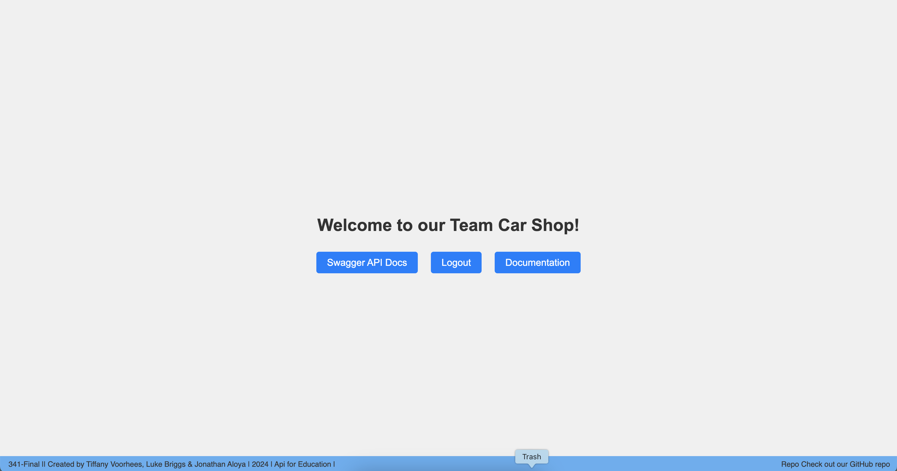

# **Team Car Shop API Documentation**

Welcome to the **Team Car Shop Api**, your gateway to managing car, brand, user, and review data. Authentication is required for certain operations. A homepage and Swagger UI is available for easy exploration.

## **Base URL**

[**Team Car Shop on Render**](https://cse341-teamproject-carshop.onrender.com)

## **Our Homepage**

Unlike most Api you might use while building projects, we wanted ours to have a built in landing page. (Mostly because we don’t have a website like other Api's ;) This page gives you some quick information, like if you are logged in or not, and also gives you quick links.
- `/login`: Login
- `/logout`: Logout
- `/api-docs`: Visit Swagger UI
- `documentation`: Link to documentation

Besides these few quick links the Api can be used as normal, either by adding `/yourWantend/path/orMaybeCar:ID` in the url or with Swagger Ui. 

---

## **API Endpoints**

### 1. **Authentication**

- **Base URL**: `/`
- **Description**: Manages user login and logout.
- **Endpoints**:
    - `GET /login`: Start authentication.
    - `GET /logout`: Logout the user.

---

### 2. **Cars**

- **Base URL**: `/cars`
- **Description**: Perform CRUD operations on cars.
- **Endpoints**:
    - `GET /cars`: Get all cars.
    - `GET /cars/:id`: Get a car by its ID.
    - `POST /cars`: Add a new car (requires authentication).
    - `PUT /cars/:id`: Update a car (requires authentication).
    - `DELETE /cars/:id`: Delete a car (requires authentication).

---

### 3. **Brands**

- **Base URL**: `/brands`
- **Description**: Manage car brands.
- **Endpoints**:
    - `GET /brands`: Get all car brands.
    - `GET /brands/:id`: Get a brand by its ID.
    - `POST /brands`: Add a new brand (requires authentication).
    - `PUT /brands/:id`: Update a brand (requires authentication).
    - `DELETE /brands/:id`: Delete a brand (requires authentication).

---

### 4. **Users**

- **Base URL**: `/users`
- **Description**: Manage user data and profiles.
- **Endpoints**:
    - `GET /users`: Get all users.
    - `GET /users/:id`: Get a user by their ID.
    - `PUT /users/:id`: Update user info (requires authentication).
    - `DELETE /users/:id`: Delete a user (requires authentication).

---

### 5. **Reviews**

- **Base URL**: `/reviews`
- **Description**: Manage car and brand reviews.
- **Endpoints**:
    - `GET /reviews`: Get all reviews.
    - `GET /reviews/:id`: Get a review by its ID.
    - `POST /reviews`: Add a review (requires authentication).
    - `PUT /reviews/:id`: Update a review (requires authentication).
    - `DELETE /reviews/:id`: Delete a review (requires authentication).

---

### 6. **Home Route**

- **URL**: `/`
- **Method**: `GET`
- **Description**: Api homepage.
- **Endpoints**
	- `/login`: Login
	- `/logout`: Logout
	- `/api-docs`: Visit Swagger UI
	- `documentation`: Link to documentation

---

## **Errors You Might See**

- **400 Bad Request**: Invalid input or missing required fields.
- **404 Not Found**: The requested resource doesn't exist.
- **500 Internal Server Error**: Something went wrong on the server.

---

### **Created By**

Tiffany Voorhees, Luke Briggs & Jonathan Aloya

---
